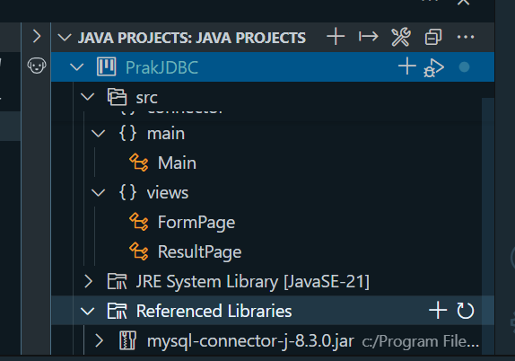
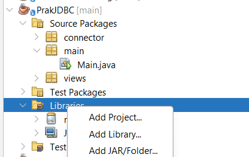

# PrakJDBC

Proyek ini adalah implementasi dasar Java Database Connectivity (JDBC) menggunakan koneksi ke MySQL. Project ini bisa dibuka di **VS Code** atau **NetBeans**.

---

## ✅ Langkah-Langkah Menjalankan Project

### 1. Download MySQL Connector JAR
Download file `mysql-connector-j-8.3.0.jar` dari link berikut:

🔗 [Download mysql-connector-j-8.3.0.jar](https://drive.google.com/file/d/18yqW_8OzOznHHMDV0-MIvjQHfpXQFvKD/view?usp=sharing)

---

### 2. Clone / Buka Project
Clone atau buka folder project ini di **VS Code** atau **NetBeans** sesuai preferensimu.

---

### 3. Import JAR ke Proyek

#### 📘 Jika Menggunakan VS Code:
- Buka tab **JAVA PROJECTS** di sidebar.
- Di bagian **Referenced Libraries**, klik ikon ➕.
- Pilih file `mysql-connector-j-8.3.0.jar` yang telah kamu download.
- Setelah berhasil, library MySQL akan muncul di daftar.

📷 Contoh (VS Code):

---

#### ☕ Jika Menggunakan NetBeans:
- Klik kanan pada folder **Libraries** dalam proyek.
- Pilih `Add JAR/Folder...`
- Arahkan ke lokasi file `mysql-connector-j-8.3.0.jar`.
- Klik Open untuk menambahkannya ke proyek.

📷 Contoh (NetBeans):

---

### 4. Jalankan Proyek
Pastikan:
- Database MySQL aktif.
- Konfigurasi koneksi di file Java sudah sesuai (hostname, port, user, password, dan nama database).

Jalankan `Main.java` untuk memulai aplikasi.

---

## 📁 Struktur Project
